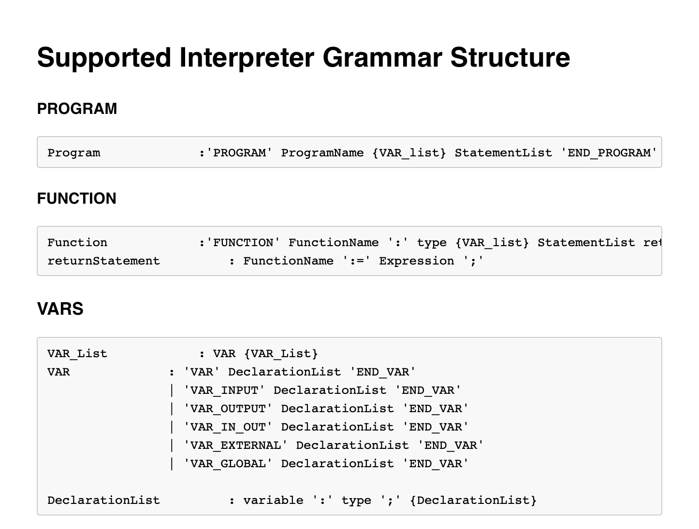
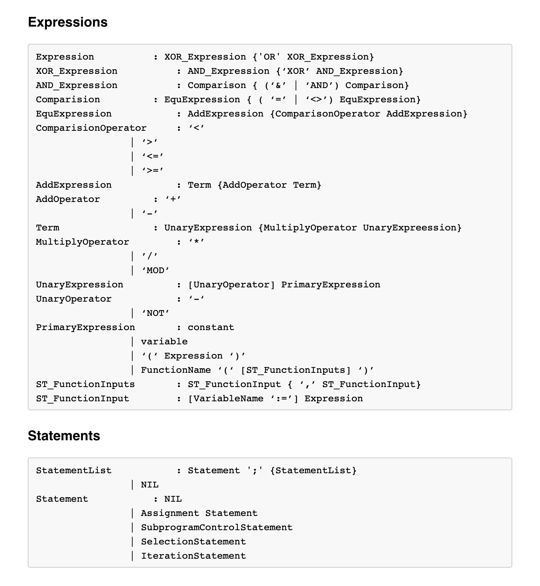
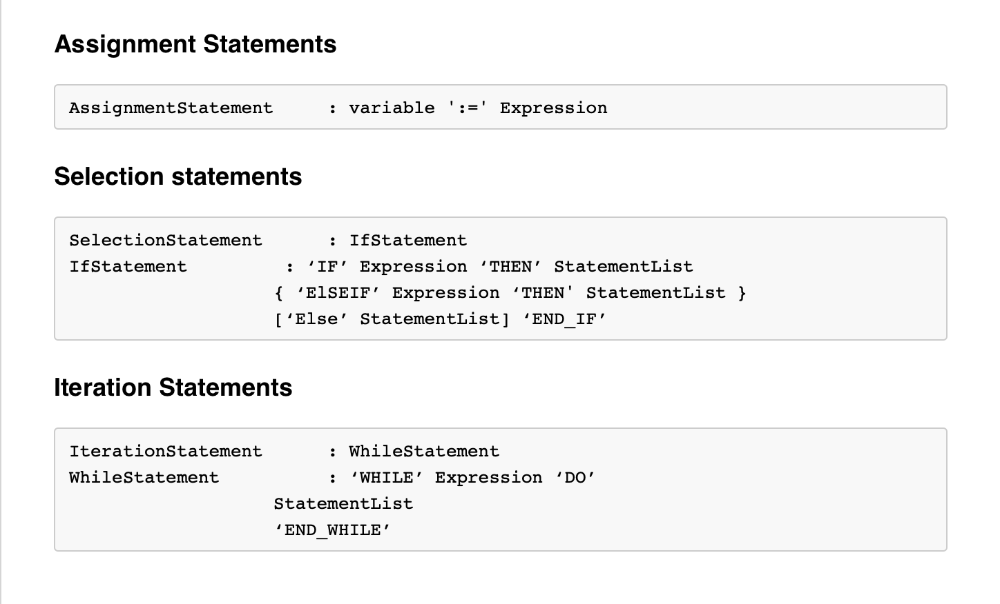

# Structured Text Interpreter

## Team Members
- Anna Rift
- Carson Thompson
- Doug Tucker
- Natalie Reece
- Rob Muschamp

## Project Abstract

Structured Text is a programming language used by Programmable Logic Controllers (PLCs) in modern robotic manufacturing facilities. As modern facilities become more complex and varied, so do the software requirements for traditional PLCs. Structured Text is a IEC 61131-3 standard language, supported by a significant number of PLC platforms, and very commonly used in Industrial Automation environments. Outside of costly proprietary options, PLC programming environments are very limited. For example, if a business uses an Allen Bradley PLC, the business must also use the Allen Bradley Integrated Development Environment (IDE).

To resolve this, we created write an open-source interpreter for basic Structured Text in the programming language Rust with a C API which can be used to execute Structured Text code natively free of proprietary restraints.This would allows the creation of a development environment for Structured Text with debugging and automated testing abilities, without the need for long development cycles involving expensive and specific PLC hardware.

## Project Description

With the use of the Interpreter currently a user can write and run a Structured Text program capable of performing basic arithmetic, Loops and selection statements as well as being able to call functions stored in separate files in the directory. A Step function even allows a user to step through the program a single statement at a time to monitor the changes occuring in the variable values.

### Parsing

When a Structured Text file is loaded into our interpreter it is first parsed and broken into an abstract syntax tree. This is an intermediate representation of the program in which all the information and structural properties needed to then execute the program. We use the [lalrpop](https://github.com/lalrpop/lalrpop) parser-generator library to accomplish this process. This constructed AST is then passed to the runtime for evaluation of the program.

### Runtime

After parsing is complete and the AST has been generated, the interpreter moves through the AST nodes and evaluates them as it traverses. The program handle is used to step through the program by walking through the list of statement nodes. This is used for control flow when using if statements and while loops.

### User API

The following functions are provided:
* st_program_load(filename: &str) -> InterpreterResult<ProgHandle> - loads a program from a file
* st_program_step(program_handle: &mut ProgHandle) -> InterpreterResult<bool> - steps forward one line in the program
* st_program_run(program_handle: &mut ProgHandle) -> InterpreterResult<()> - runs the whole program
* get_all_vars(program_handle: &ProgHandle) -> Iter<'\_, String, VariableInfo> - returns all the currently in scope variables
* get_var(program_handle: &ProgHandle, name: String) -> Option<&VariableInfo> - returns a variable with the given name
* update_var(program_handle: &mut ProgHandle, name: &str, new_value: VariableValue) -> InterpreterResult<()> - changes the value of a variable
* add_var(program_handle: &mut ProgHandle, name: String, kind: VariableKind, value: VariableValue) -> InterpreterResult<()> - adds a new variable

### Current Supported Grammar

While our implementation does not cover the entire structured text language, We do currently support a majority of basic programming functionality and enforce the IEC 61131-3 standard.

Below is the current context free grammar implemented into the program that shows the general structure and specifies how we maintain order of precedence. Structurally wise Structured Text is constructed very similarly to that of the Pascal language.

